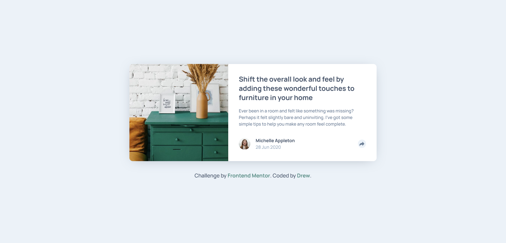

# Frontend Mentor - Article preview component solution

This is a solution to the [Article preview component challenge on Frontend Mentor](https://www.frontendmentor.io/challenges/article-preview-component-dYBN_pYFT). Frontend Mentor challenges help you improve your coding skills by building realistic projects. 

## Table of contents

- [Overview](#overview)
  - [The challenge](#the-challenge)
  - [Screenshot](#screenshot)
  - [Links](#links)
- [My process](#my-process)
  - [Built with](#built-with)
  - [What I learned](#what-i-learned)
  - [Continued development](#continued-development)
  - [Useful resources](#useful-resources)
- [Author](#author)
- [Acknowledgments](#acknowledgments)

## Overview

### The challenge

Users should be able to:

- View the optimal layout for the component depending on their device's screen size
- See the social media share links when they click the share icon

### Screenshot

### Links

- Solution URL: [Click Here](https://github.com/24FContreras/FM-articlePreviewComponent)
- Live Site URL: [Click Here](https://24fcontreras.github.io/FM-articlePreviewComponent/)

## My process

### Built with

- Semantic HTML5 markup
- CSS and sass (scss)
- Flexbox
- Mobile-first workflow
- Vanilla JS

### What I learned

During this project I learned a lot of accessibility, trying to make everything good in that area for the icon buttons. 

### Continued development

I had many problems during the challenge with the footer social share element. While I arrived to a functional answer to the problematic, I feel I could do so much better to make that part of the card.

From now onwards I'll try to learn much more on accessibility. This project challenged me to add many new elements to my code, and I'm really thankful for it.

## Author

- Frontend Mentor - [@24FContreras](https://www.frontendmentor.io/profile/24FContreras)
- Github - [@24FContreras](https://github.com/24FContreras)
- Discord - Tealshark#0029